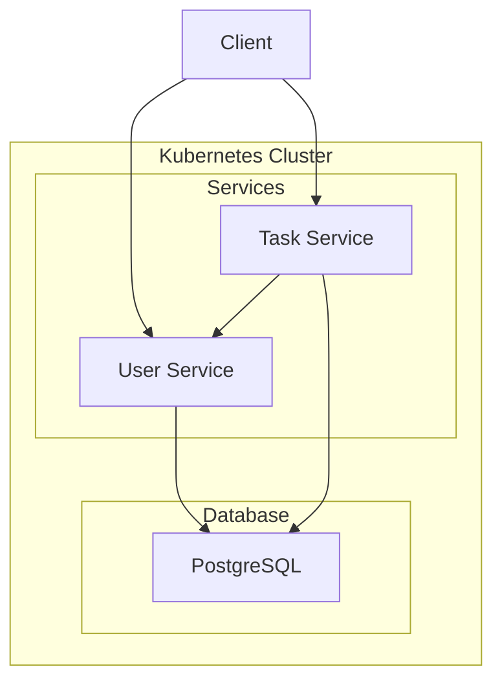

# Team Task Hub

A comprehensive project demonstrating the implementation of a microservices-based task management system using Spring Boot, Docker, and Kubernetes.

## Problem Statement

The goal of this project is to build a scalable and resilient task management application. It addresses the challenges of monolithic architectures by breaking down the system into independent, deployable microservices. This approach facilitates easier development, testing, and deployment, while also providing a practical learning path for modern cloud-native technologies.

## Key Features

-   **User Management**: Secure user registration and authentication.
-   **Task Management**: Create, update, delete, and assign tasks.
-   **Microservices Architecture**: Independent services for users and tasks.
-   **Containerization**: Dockerized services for consistent environments.
-   **Orchestration**: Kubernetes for automated deployment, scaling, and management.
-   **Service-to-Service Communication**: RESTful APIs and Feign clients for inter-service communication.

## Technology Stack

-   **Backend**: Java, Spring Boot
-   **Database**: PostgreSQL
-   **Security**: Spring Security, JWT
-   **Containerization**: Docker, Docker Compose
-   **Orchestration**: Kubernetes, Minikube
-   **Build Tool**: Maven

## Project Architecture

The application is designed as a set of communicating microservices.



## Folder Structure

```
team-task-hub/
├── .dockerignore
├── .gitignore
├── docker-compose.yml
├── k8s/
│   ├── user-service.yaml
│   └── task-service.yaml
├── pom.xml
├── README.md
├── task-service/
│   ├── Dockerfile
│   └── ...
└── user-service/
    ├── Dockerfile
    └── ...
```

## Microservices

| Service        | Port | Responsibilities                               |
| :------------- | :--- | :--------------------------------------------- |
| **User Service** | 8081 | Manages user accounts, authentication, and profiles. |
| **Task Service** | 8082 | Manages tasks, assignments, and status updates.    |

## Setup and Deployment

### Prerequisites

-   Java 17+
-   Maven
-   Docker
-   Minikube

### Local Development

1.  **Clone the repository:**
    ```bash
    git clone <repository-url>
    cd team-task-hub
    ```

2.  **Run each service:**
    Navigate to each service's directory (`user-service`, `task-service`) and run:
    ```bash
    mvn spring-boot:run
    ```

### Docker Compose

1.  **Build and run the services:**
    ```bash
    docker-compose up --build
    ```

### Kubernetes (Minikube)

1.  **Start Minikube:**
    ```bash
    minikube start
    ```

2.  **Apply Kubernetes manifests:**
    ```bash
    kubectl apply -f k8s/
    ```

## 📚 Lessons / Documentation

This project is structured into a series of lessons that guide you through the development and deployment process.

| Lesson | Topic                                           |
| :----- | :---------------------------------------------- |
| 01     | Project & Microservices Architecture            |
| 02     | User Service                                    |
| 03     | Task Service                                    |
| 04     | REST vs Feign / Service-to-Service Communication|
| 05     | JWT Authentication & Spring Security            |
| 06     | PostgreSQL & Database Design                    |
| 07     | Docker Fundamentals                             |
| 08     | Dockerfiles & .dockerignore                     |
| 09     | Docker Compose                                  |
| 10     | Kubernetes Fundamentals                         |
| 11     | Minikube Setup                                  |
| 12     | Kubernetes Namespace                            |
| 13     | Deployments & ReplicaSets                       |
| 14     | Kubernetes Services & DNS                       |
| 15     | PersistentVolume & PersistentVolumeClaim        |
| 16     | StatefulSets for PostgreSQL                     |
| 17     | Kubernetes Resource Requests & Limits           |
| 18     | Kubernetes Troubleshooting                      |
| 19     | ConfigMaps                                      |
| 20     | Kubernetes Secrets                              |
| 21     | Kubernetes Service-to-Service Communication     |
| 22     | Rolling Updates                                 |
| 23     | Health Checks / Readiness & Liveness Probes     |
| 24     | Scaling Microservices                           |
| 25     | Ingress / External Access                       |
| 26     | Frontend Deployment                             |
| 27     | Complete Deployment Architecture                |
| 28     | Final Revision & Interview Notes                |

---

*This README was generated with the assistance of an AI tool.*
