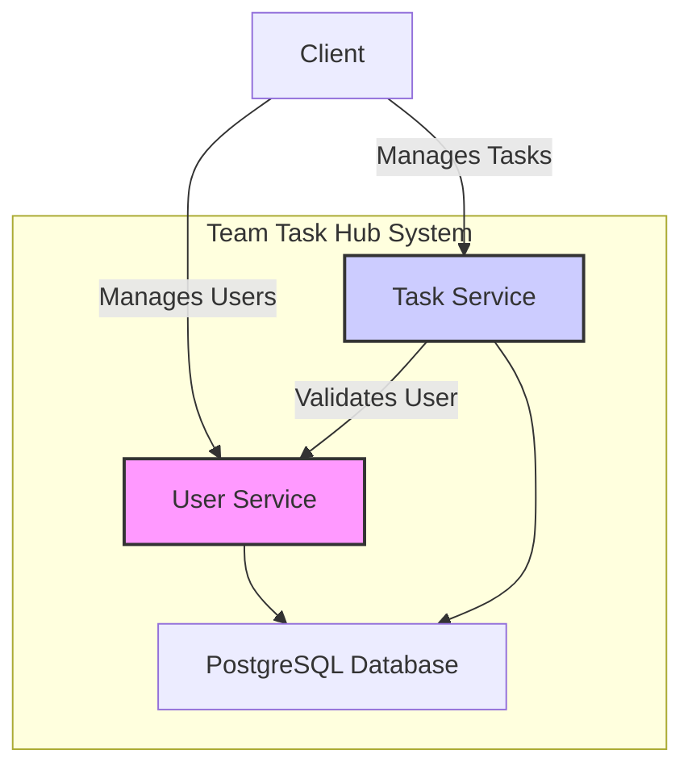

# Lesson 01: Project & Microservices Architecture

## What We Learned
This lesson introduces the foundational concepts of a microservices architecture. We explore why this architectural style was chosen for the **Team Task Hub** project and how it contrasts with traditional monolithic designs.

## Why Do We Need This?
In a traditional **monolithic architecture**, all features and functionalities of an application are bundled into a single, large codebase. This can lead to several challenges as the application grows:
-   **Difficult to Scale**: Scaling one feature means scaling the entire application.
-   **Slow Development**: A large codebase is harder to understand and modify.
-   **Technology Lock-in**: The entire application is tied to a single technology stack.
-   **Low Fault Tolerance**: A failure in one component can bring down the entire system.

**Microservices** solve these problems by breaking down the application into a collection of small, independent services. Each service:
-   Is built around a specific business capability.
-   Can be developed, deployed, and scaled independently.
-   Can be written in different programming languages.
-   Communicates with other services over well-defined APIs.

This approach provides the agility and scalability required for modern, cloud-native applications.

## Architecture / Flow
The **Team Task Hub** project is divided into two core microservices: `user-service` and `task-service`.

-   **User Service**: Handles all user-related concerns, such as registration, login, and profile management.
-   **Task Service**: Manages tasks, including creation, assignment, and status updates. It communicates with the User Service to validate user information.

## Project Implementation
The project is structured with two separate Spring Boot applications, each representing a microservice:
-   `user-service/`: Contains the logic for user management.
-   `task-service/`: Contains the logic for task management.

This separation allows us to develop and deploy each service independently, which is a core principle of microservices.

## Important Takeaways
-   Microservices offer better scalability, flexibility, and resilience compared to monoliths.
-   Our project is divided into `user-service` and `task-service` to separate concerns.
-   Services communicate with each other through APIs, which we will explore in later lessons.

## Navigation
| Previous Lesson | Main README | Next Lesson |
| :--- | :--- | :--- |
| - | [Main README](../../README.md) | [Lesson 02: User Service](../02-user-service/README.md) |
