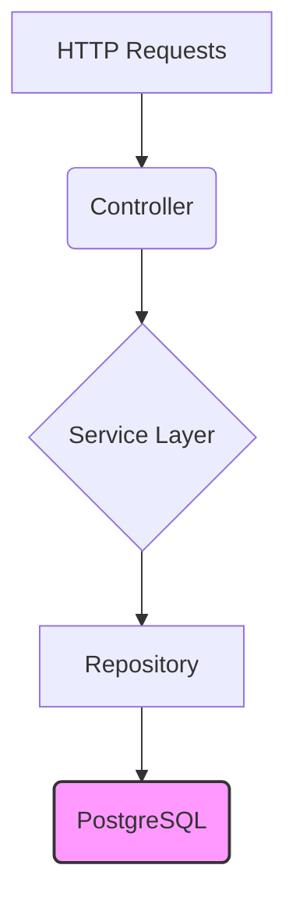

# Lesson 02: User Service

## What We Learned
This lesson covers the implementation of the **User Service**, a core component of our microservices architecture. We explore its responsibilities, how it's built using Spring Boot, and its connection to the PostgreSQL database.

## Why Do We Need This?
The User Service is responsible for all user-related functionality. By centralizing user management, we create a single source of truth for user data. This is crucial for security and data consistency. Any other service that needs to verify a user's identity or retrieve user information will communicate with the User Service.

## Architecture / Flow
The User Service is a standard Spring Boot application with a layered architecture.



-   **Controller**: Exposes REST endpoints for user registration, login, and profile management.
-   **Service Layer**: Contains the business logic for user operations.
-   **Repository**: Interacts with the PostgreSQL database to store and retrieve user data.

## Project Implementation
The `user-service` directory contains a complete Spring Boot application.

### Key Files
-   `src/main/java/.../UserController.java`: Defines the REST API endpoints.
-   `src/main/java/.../UserService.java`: Implements the business logic.
-   `src/main/java/.../UserRepository.java`: A Spring Data JPA repository for database interaction.
-   `src/main/resources/application.properties`: Configuration for the database connection and other settings.

### Configuration (`application.properties`)
```properties
spring.application.name=user-service
server.port=8081

spring.datasource.url=jdbc:postgresql://localhost:5432/user_db
spring.datasource.username=user
spring.datasource.password=password
spring.jpa.hibernate.ddl-auto=update
```

## Commands
To run the User Service locally:
```bash
cd user-service
mvn spring-boot:run
```

## Testing
You can test the User Service by sending HTTP requests to its endpoints. For example, to register a new user:
```bash
POST http://localhost:8081/api/users/register
Content-Type: application/json

{
  "username": "testuser",
  "password": "password"
}
```

## Important Takeaways
-   The User Service is a self-contained Spring Boot application.
-   It follows a standard layered architecture (Controller, Service, Repository).
-   It connects to a PostgreSQL database to persist user data.

## Navigation
| Previous Lesson | Main README | Next Lesson |
| :--- | :--- | :--- |
| [Lesson 01](../01-project-and-microservices-architecture/README.md) | [Main README](../../README.md) | [Lesson 03: Task Service](../03-task-service/README.md) |
