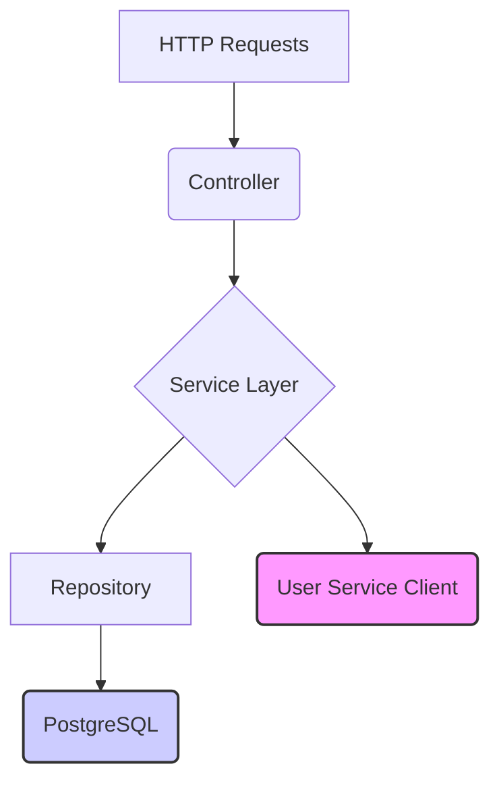

# Lesson 03: Task Service

## What We Learned
This lesson details the **Task Service**, the second microservice in our application. We'll look at its role, how it's implemented, and how it prepares to communicate with the User Service.

## Why Do We Need This?
The Task Service handles all business logic related to tasks. This includes creating, updating, assigning, and tracking the status of tasks. By separating this from the User Service, we can develop and scale each service independently. For example, if the task management features become more complex, we can allocate more resources to the Task Service without impacting the User Service.

## Architecture / Flow
Similar to the User Service, the Task Service follows a layered architecture.



-   **Controller**: Exposes REST endpoints for task operations.
-   **Service Layer**: Contains the business logic for managing tasks.
-   **Repository**: Interacts with the PostgreSQL database.
-   **User Service Client**: A component responsible for communicating with the User Service (to be detailed in the next lesson).

## Project Implementation
The `task-service` directory contains the Spring Boot application for this microservice.

### Key Files
-   `src/main/java/.../TaskController.java`: Defines the REST API endpoints for tasks.
-   `src/main/java/.../TaskService.java`: Implements the business logic.
-   `src/main/java/.../TaskRepository.java`: A Spring Data JPA repository.
-   `src/main/resources/application.properties`: Configuration for the database and other settings.

### Configuration (`application.properties`)
```properties
spring.application.name=task-service
server.port=8082

spring.datasource.url=jdbc:postgresql://localhost:5432/task_db
spring.datasource.username=user
spring.datasource.password=password
spring.jpa.hibernate.ddl-auto=update
```

## Commands
To run the Task Service locally:
```bash
cd task-service
mvn spring-boot:run
```

## Testing
To create a new task, you can send a request like this (assuming a valid `userId`):
```bash
POST http://localhost:8082/api/tasks
Content-Type: application/json

{
  "title": "Implement Task Service",
  "description": "Complete the implementation of the Task Service.",
  "userId": 1
}
```

## Important Takeaways
-   The Task Service is a dedicated microservice for managing tasks.
-   It has its own database and runs independently of the User Service.
-   It will need to communicate with the User Service to validate user information, which is a key aspect of service-to-service communication.

## Navigation
| Previous Lesson | Main README | Next Lesson |
| :--- | :--- | :--- |
| [Lesson 02](../02-user-service/README.md) | [Main README](../../README.md) | [Lesson 04: REST vs Feign](../04-rest-vs-feign/README.md) |
