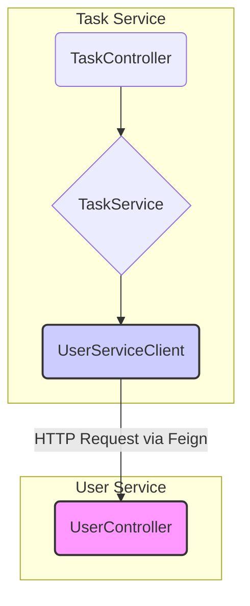

# Lesson 04: REST vs Feign / Service-to-Service Communication

## What We Learned
This lesson explores how microservices communicate with each other. We compare two common approaches in Spring Boot: using `RestTemplate` and using **Feign Client**.

## Why Do We Need This?
In our architecture, the `task-service` needs to get user information from the `user-service`. For example, when a task is assigned to a user, the `task-service` might need to verify that the user exists. This requires a communication channel between the two services.

### `RestTemplate`
`RestTemplate` is a traditional way to make HTTP requests in Spring. It's flexible but can be verbose. You have to manually construct the URL, set headers, and handle the response.

```java
// Example with RestTemplate
User user = restTemplate.getForObject("http://user-service/api/users/" + userId, User.class);
```

### Feign Client
**Feign** is a declarative REST client from Netflix. It makes writing web service clients easier. You simply create an interface and annotate it. Spring Cloud integrates Feign, automatically generating the implementation for you. This approach is cleaner and more readable.

```java
// Example with Feign Client
@FeignClient(name = "user-service")
public interface UserServiceClient {
    @GetMapping("/api/users/{id}")
    User getUserById(@PathVariable("id") Long id);
}
```

We will use Feign Client in our project for its simplicity and better integration with Spring Cloud.

## Architecture / Flow
When the `task-service` needs user data, it calls a method on the `UserServiceClient` interface. Feign intercepts this call and makes an HTTP request to the `user-service`.



## Project Implementation
To use Feign, we need to:
1.  Add the `spring-cloud-starter-openfeign` dependency in `task-service/pom.xml`.
2.  Enable Feign clients in the main application class with `@EnableFeignClients`.
3.  Create the `UserServiceClient` interface as shown above.
4.  Inject and use the `UserServiceClient` in the `TaskService`.

### `task-service/pom.xml`
```xml
<dependency>
    <groupId>org.springframework.cloud</groupId>
    <artifactId>spring-cloud-starter-openfeign</artifactId>
</dependency>
```

### `TaskServiceApplication.java`
```java
@SpringBootApplication
@EnableFeignClients
public class TaskServiceApplication {
    // ...
}
```

## Important Takeaways
-   Microservices communicate over the network, typically using HTTP/REST.
-   `RestTemplate` is a manual way to make HTTP requests.
-   **Feign Client** is a declarative, interface-based approach that simplifies service-to-service communication.
-   We use Feign for its clean syntax and integration with Spring Cloud.

## Navigation
| Previous Lesson | Main README | Next Lesson |
| :--- | :--- | :--- |
| [Lesson 03](../03-task-service/README.md) | [Main README](../../README.md) | [Lesson 05: JWT Authentication](../05-jwt-authentication/README.md) |
