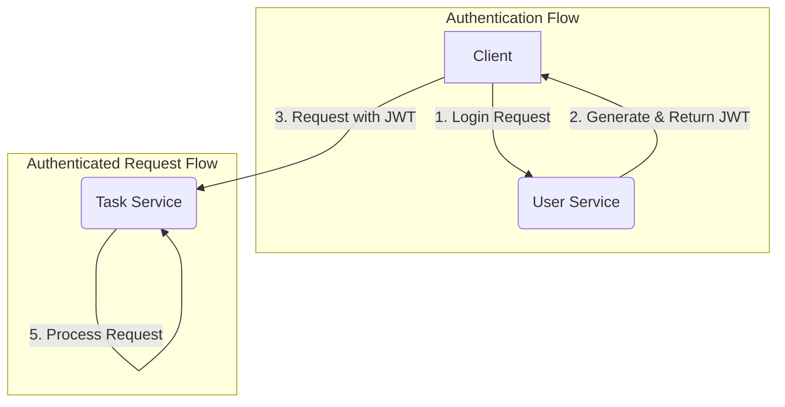

# Lesson 05: JWT Authentication & Spring Security

## What We Learned
This lesson covers how to secure our microservices using **Spring Security** and **JSON Web Tokens (JWT)**. We'll focus on how the `user-service` generates a token and how other services can validate it.

## Why Do We Need This?
In a microservices architecture, we can't rely on traditional session-based authentication. Since requests can go to different services, we need a stateless way to verify the user's identity. JWT is an excellent solution for this.

**How it works:**
1.  A user logs in to the `user-service` with their credentials.
2.  The `user-service` validates the credentials and generates a JWT. This token contains user information (like username and roles) and is signed with a secret key.
3.  The `user-service` returns the JWT to the client.
4.  The client then includes this JWT in the `Authorization` header for all subsequent requests to any microservice.
5.  Each microservice can independently validate the JWT using the shared secret key, without needing to call the `user-service` every time.

## Architecture / Flow

## Project Implementation
We will use the `spring-boot-starter-security` and a JWT library (like `jjwt`) in our services.

### `user-service`
-   **Security Configuration**: Configure Spring Security to protect endpoints and add a filter for JWT generation upon successful authentication.
-   **JWT Provider**: A utility class to create and sign JWTs.
-   **Login Endpoint**: A controller endpoint (`/api/users/login`) that takes credentials and returns a JWT.

### `task-service` (and other services)
-   **Security Configuration**: Configure Spring Security to protect endpoints.
-   **JWT Validation Filter**: A filter that intercepts incoming requests, extracts the JWT from the `Authorization` header, and validates it. If the token is valid, the user's identity is placed in the security context.

### Shared Secret
A crucial part of this setup is the **JWT secret key**. This key is used to sign the token in the `user-service` and to validate the signature in other services. This secret must be securely shared among the services. We will later use **Kubernetes Secrets** to manage this.

## Important Takeaways
-   **Stateless Authentication**: JWT allows for stateless authentication, which is ideal for microservices.
-   **Spring Security**: Provides the framework for securing our application.
-   **JWT Generation**: The `user-service` is responsible for generating tokens.
-   **JWT Validation**: All services are responsible for validating tokens on incoming requests.
-   **Shared Secret**: The security of the system relies on keeping the JWT secret key safe.

## Navigation
| Previous Lesson | Main README | Next Lesson |
| :--- | :--- | :--- |
| [Lesson 04](../04-rest-vs-feign/README.md) | [Main README](../../README.md) | [Lesson 06: PostgreSQL & Database Design](../06-postgresql-database-design/README.md) |
