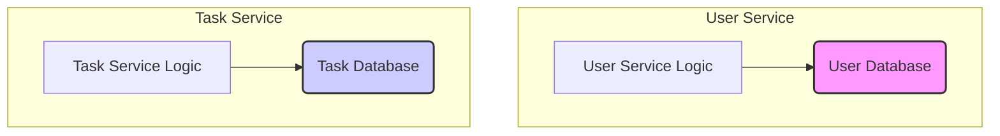

# Lesson 06: PostgreSQL & Database Design

## What We Learned
This lesson focuses on the persistence layer of our application. We discuss why **PostgreSQL** was chosen as our database and the design principle of having a **database per service**.

## Why Do We Need This?
In a microservices architecture, it's a common pattern for each service to own its own data. This is known as **database per service**.

**Advantages:**
-   **Loose Coupling**: Services are independent. Changes to one service's database schema don't directly impact other services.
-   **Independent Scaling**: We can scale the database for a specific service based on its needs.
-   **Flexibility**: Each service can choose the database technology that best suits its requirements (e.g., SQL for one service, NoSQL for another).

For this project, we are using PostgreSQL for both the `user-service` and the `task-service`, but they will connect to separate databases (or schemas) to maintain their independence.

## Architecture / Flow
Each microservice has its own dedicated database. This ensures that a service's data can only be accessed through its API.



Direct communication between databases is not allowed. If the `task-service` needs user data, it must go through the `user-service`'s API.

## Project Implementation
We use **Spring Data JPA** to interact with the PostgreSQL databases.

### `user-service` (`application.properties`)
```properties
spring.datasource.url=jdbc:postgresql://localhost:5432/user_db
spring.datasource.username=user
spring.datasource.password=password
spring.jpa.hibernate.ddl-auto=update
```

### `task-service` (`application.properties`)
```properties
spring.datasource.url=jdbc:postgresql://localhost:5432/task_db
spring.datasource.username=user
spring.datasource.password=password
spring.jpa.hibernate.ddl-auto=update
```

Notice that each service connects to a different database (`user_db` and `task_db`). When we move to Kubernetes, we will manage these database connections and credentials securely.

## Important Takeaways
-   **Database Per Service**: Each microservice should have its own private database.
-   **No Direct Database Access**: Services should not directly access each other's databases. All communication must happen through APIs.
-   **PostgreSQL**: A powerful open-source relational database suitable for a wide range of applications.
-   **Spring Data JPA**: Simplifies database interaction in Spring applications.

## Navigation
| Previous Lesson | Main README | Next Lesson |
| :--- | :--- | :--- |
| [Lesson 05](../05-jwt-authentication/README.md) | [Main README](../../README.md) | [Lesson 07: Docker Fundamentals](../07-docker-fundamentals/README.md) |
