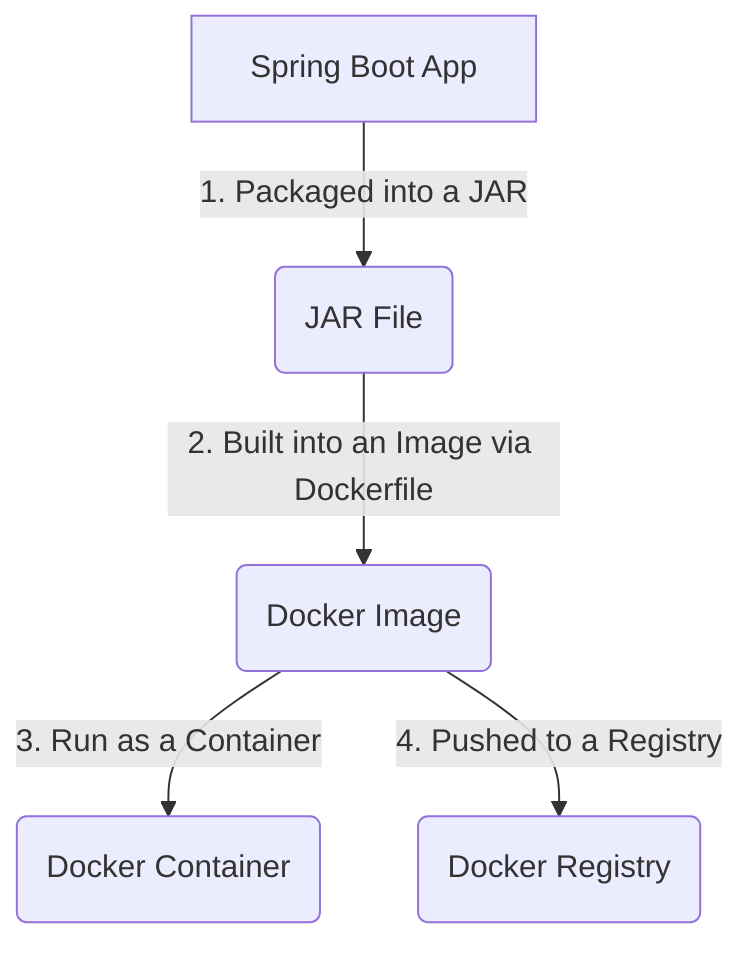

# Lesson 07: Docker Fundamentals

## What We Learned
This lesson introduces **Docker**, the containerization platform we'll use to package our microservices. We'll cover the basic concepts of Docker, including images, containers, and the Dockerfile.

## Why Do We Need This?
Before we can deploy our application to Kubernetes, we need to package it in a way that is portable and consistent. Docker allows us to do this by creating **containers**.

A container is a lightweight, standalone, executable package that includes everything needed to run a piece of software, including the code, runtime, system tools, system libraries, and settings.

**Key Benefits:**
-   **Consistency**: A container runs the same way regardless of the environment (developer's laptop, testing server, or production). This solves the "it works on my machine" problem.
-   **Isolation**: Containers run in isolation from each other and the host operating system.
-   **Portability**: You can build a container once and run it anywhere Docker is installed.
-   **Efficiency**: Containers are much more lightweight than virtual machines.

## Core Docker Concepts

-   **Image**: A read-only template used to create containers. An image is built from a `Dockerfile`. For our project, we will create Docker images for the `user-service` and `task-service`.
-   **Container**: A runnable instance of an image. We can run multiple containers from the same image.
-   **Dockerfile**: A text file that contains instructions for building a Docker image. It specifies the base image, application code, dependencies, and commands to run.
-   **Docker Hub / Registry**: A place to store and distribute Docker images.

## Architecture / Flow
The process of using Docker in our project looks like this:

We will write a `Dockerfile` for each of our microservices. This `Dockerfile` will define how to create a Docker image containing our Spring Boot application.

## Important Takeaways
-   **Docker** packages applications into portable containers.
-   **Images** are templates for containers.
-   **Containers** are running instances of images.
-   A **Dockerfile** contains the instructions to build an image.
-   Containerizing our services is the first step towards deploying them with Kubernetes.

## Navigation
| Previous Lesson | Main README | Next Lesson |
| :--- | :--- | :--- |
| [Lesson 06](../06-postgresql-database-design/README.md) | [Main README](../../README.md) | [Lesson 08: Dockerfiles & .dockerignore](../08-dockerfiles-and-dockerignore/README.md) |
