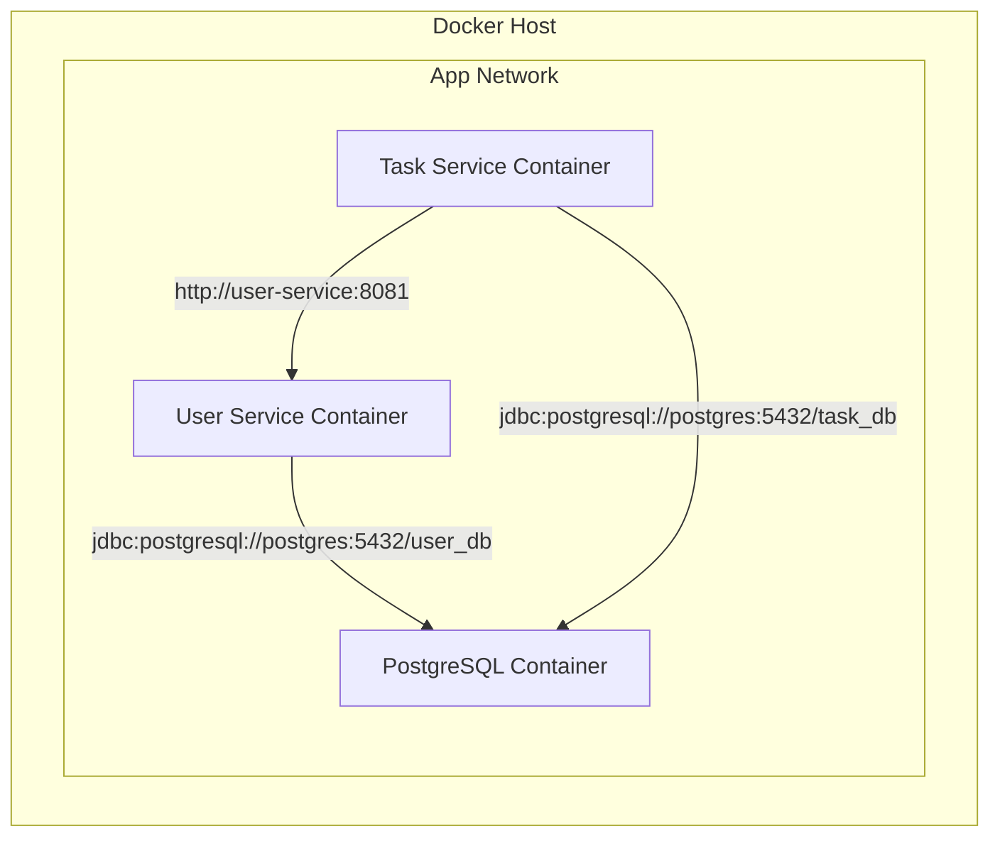

# Lesson 09: Docker Compose

## What We Learned
This lesson introduces **Docker Compose**, a tool for defining and running multi-container Docker applications. We'll create a `docker-compose.yml` file to run our entire application stack (`user-service`, `task-service`, and `postgres`) with a single command.

## Why Do We Need This?
While `docker run` is fine for a single container, our application consists of multiple services that need to work together. Manually starting each container and connecting them on a network is tedious and error-prone.

Docker Compose simplifies this process. You define all your services, networks, and volumes in a single YAML file (`docker-compose.yml`). Then, with the command `docker-compose up`, you can create and start everything.

## Architecture / Flow
Docker Compose will create a default network for our application, allowing the containers to discover and communicate with each other using their service names as hostnames.



## Project Implementation
Here is the `docker-compose.yml` file for our project:

```yaml
version: '3.8'

services:
  postgres:
    image: postgres:13
    container_name: postgres
    environment:
      POSTGRES_USER: user
      POSTGRES_PASSWORD: password
      POSTGRES_DB: user_db,task_db # Not a standard way to create multiple DBs
    ports:
      - "5432:5432"
    volumes:
      - postgres_data:/var/lib/postgresql/data

  user-service:
    build:
      context: .
      dockerfile: user-service/Dockerfile
    container_name: user-service
    depends_on:
      - postgres
    environment:
      - SPRING_DATASOURCE_URL=jdbc:postgresql://postgres:5432/user_db
      - SPRING_DATASOURCE_USERNAME=user
      - SPRING_DATASOURCE_PASSWORD=password
      - JWT_SECRET=your-super-secret-key-that-is-long-enough
    ports:
      - "8081:8081"

  task-service:
    build:
      context: .
      dockerfile: task-service/Dockerfile
    container_name: task-service
    depends_on:
      - postgres
      - user-service
    environment:
      - SPRING_DATASOURCE_URL=jdbc:postgresql://postgres:5432/task_db
      - SPRING_DATASOURCE_USERNAME=user
      - SPRING_DATASOURCE_PASSWORD=password
      - USER_SERVICE_URL=http://user-service:8081
      - JWT_SECRET=your-super-secret-key-that-is-long-enough
    ports:
      - "8082:8082"

volumes:
  postgres_data:
```
*(Note: The standard `postgres` image doesn't support creating multiple databases via `POSTGRES_DB`. A custom script is usually needed for that, but for simplicity, we've listed them here. In a real scenario, you might use an init script.)*

**Key Points:**
-   **`services`**: Defines our three containers: `postgres`, `user-service`, and `task-service`.
-   **`build`**: Tells Docker Compose to build the service images from their Dockerfiles.
-   **`depends_on`**: Controls the startup order.
-   **`environment`**: Sets environment variables. This is how we configure our Spring Boot applications to connect to the database and communicate with each other. Notice how `task-service` uses `http://user-service:8081` to talk to the `user-service`.
-   **`ports`**: Maps ports from the container to the host machine.
-   **`volumes`**: Persists the PostgreSQL data.

## Commands
-   **Start the application:**
    ```bash
    docker-compose up --build
    ```
-   **Stop the application:**
    ```bash
    docker-compose down
    ```

## Important Takeaways
-   **Docker Compose** is for orchestrating multi-container applications on a single host.
-   Services can communicate using their service names as hostnames.
-   Environment variables are used to configure services at runtime.
-   This is a great tool for local development and testing, but for production, we need a more powerful orchestrator like **Kubernetes**.

## Navigation
| Previous Lesson | Main README | Next Lesson |
| :--- | :--- | :--- |
| [Lesson 08](../08-dockerfiles-and-dockerignore/README.md) | [Main README](../../README.md) | [Lesson 10: Kubernetes Fundamentals](../10-kubernetes-fundamentals/README.md) |
