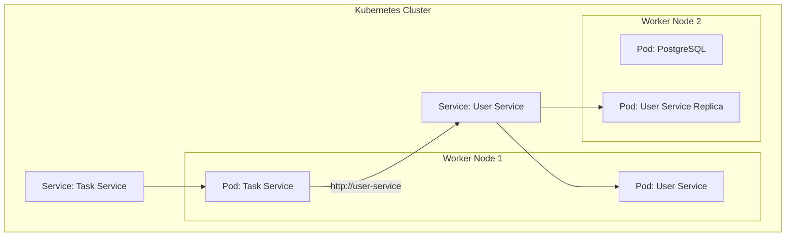

# Lesson 10: Kubernetes Fundamentals

## What We Learned
This lesson introduces **Kubernetes (K8s)**, the container orchestration platform we will use to deploy and manage our application in a production-like environment. We'll cover the core concepts of Kubernetes and why it's the de facto standard for managing containerized applications at scale.

## Why Do We Need This?
Docker Compose is great for running containers on a single machine, but it falls short for production environments. Production systems need to be:
-   **Highly Available**: The application should remain online even if a server fails.
-   **Scalable**: The application should be able to handle changes in traffic by adding or removing container instances.
-   **Self-healing**: If a container crashes, it should be automatically restarted.
-   **Automated**: Deployments, updates, and networking should be automated.

Kubernetes provides all of this and more. It's a powerful platform for automating the deployment, scaling, and management of containerized applications across a cluster of machines.

## Core Kubernetes Concepts

-   **Cluster**: A set of machines (called **Nodes**) that run containerized applications. A cluster has at least one **Master Node** and several **Worker Nodes**.
    -   **Master Node**: The control plane of the cluster. It manages the worker nodes and the Pods in the cluster.
    -   **Worker Node**: A machine where the application containers run.

-   **Pod**: The smallest and simplest unit in the Kubernetes object model. A Pod represents a single instance of a running process in a cluster. It's a wrapper around one or more containers. We will run our `user-service` and `task-service` containers inside Pods.

-   **Deployment**: A Kubernetes object that manages a set of identical Pods. It ensures that a specified number of Pods (replicas) are running at all times. If a Pod fails, the Deployment will automatically create a new one. This provides self-healing and scalability.

-   **Service**: An abstraction that defines a logical set of Pods and a policy by which to access them. A Service provides a stable IP address and DNS name for a set of Pods. This is how our microservices will discover and communicate with each other inside the cluster.

-   **Namespace**: A way to divide cluster resources between multiple users or teams. It provides a scope for names.

## Architecture / Flow
Here's how our application will look when deployed to Kubernetes:

-   We will create **Deployments** for `user-service` and `task-service`.
-   These Deployments will create and manage **Pods**.
-   We will create **Services** to expose the Pods. The `task-service` will use the DNS name `user-service` to communicate with the `user-service` Pods, thanks to the Kubernetes Service.

## Important Takeaways
-   **Kubernetes** automates the deployment, scaling, and management of containerized applications.
-   **Pods** are the smallest deployable units and run our containers.
-   **Deployments** manage Pods and provide self-healing and scaling.
-   **Services** provide stable networking and discovery for our Pods.
-   Kubernetes is the foundation for building robust, scalable, and resilient microservice systems.

## Navigation
| Previous Lesson | Main README | Next Lesson |
| :--- | :--- | :--- |
| [Lesson 09](../09-docker-compose/README.md) | [Main README](../../README.md) | [Lesson 11: Minikube Setup](../11-minikube-setup/README.md) |
