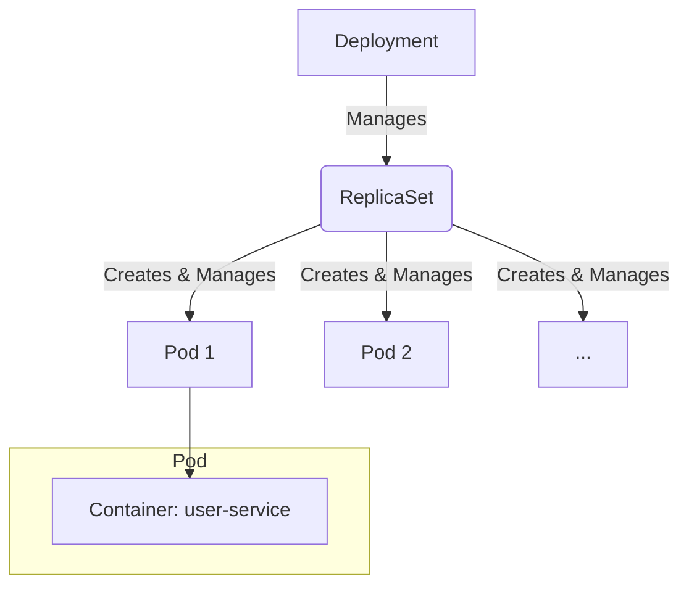

# Lesson 13: Deployments & ReplicaSets

## What We Learned
This lesson covers one of the most fundamental Kubernetes objects: the **Deployment**. We will create a Deployment to run our `user-service` on the Kubernetes cluster. We'll also touch on **ReplicaSets**, which are managed by Deployments.

## Why Do We Need This?
We could create a Pod directly to run our container, but what happens if the Pod crashes or the node it's on fails? The Pod would be gone, and our service would be down. This is not a reliable way to run applications.

A **Deployment** provides a declarative way to manage a set of identical Pods. It ensures that a specified number of Pods are running and healthy.

**Key Features of a Deployment:**
-   **Declarative Updates**: You describe the desired state in a YAML file, and Kubernetes works to make the current state match the desired state.
-   **Scalability**: You can easily scale the number of Pods up or down by changing a single value (`replicas`).
-   **Self-healing**: If a Pod managed by a Deployment fails, the Deployment automatically replaces it.
-   **Rolling Updates**: You can update your application with zero downtime. The Deployment will incrementally update Pods with the new version.

### What is a ReplicaSet?
A **ReplicaSet** is a lower-level object whose job is to ensure that a specified number of Pod replicas are running at any given time. A Deployment manages ReplicaSets. When you update a Deployment, it creates a new ReplicaSet with the new configuration and scales down the old one. You will almost always use a Deployment rather than managing ReplicaSets directly.

## Architecture / Flow
The relationship between these objects is as follows:



## Project Implementation
We will create a YAML file to define the Deployment for our `user-service`.

**`k8s/user-service-deployment.yaml`**
```yaml
apiVersion: apps/v1
kind: Deployment
metadata:
  name: user-service-deployment
  namespace: team-task-hub
spec:
  replicas: 1 # Start with one instance
  selector:
    matchLabels:
      app: user-service
  template:
    metadata:
      labels:
        app: user-service
    spec:
      containers:
        - name: user-service
          image: user-service:latest # The image we built
          imagePullPolicy: IfNotPresent # Important for local images
          ports:
            - containerPort: 8081
          env:
            - name: SPRING_DATASOURCE_URL
              value: "jdbc:postgresql://postgres-service:5432/user_db"
            - name: JWT_SECRET
              value: "your-super-secret-key-that-is-long-enough"
            # We will use Secrets for username and password later
```

**Key Fields:**
-   **`kind: Deployment`**: Specifies the object type.
-   **`spec.replicas`**: The desired number of Pods.
-   **`spec.selector.matchLabels`**: This tells the Deployment which Pods to manage. It must match the labels on the Pod template.
-   **`spec.template`**: This is the blueprint for the Pods that the Deployment will create.
    -   **`metadata.labels`**: Labels to apply to the Pods.
    -   **`spec.containers`**: A list of containers to run in the Pod.
    -   **`image`**: The Docker image to use.
    -   **`imagePullPolicy: IfNotPresent`**: This is crucial when using Minikube with local images. It tells Kubernetes not to try to pull the image from a remote registry if it already exists locally (which it does, because we built it into Minikube's Docker daemon).
    -   **`env`**: Environment variables for the container. Notice the database URL now points to a service name (`postgres-service`), which we will create later.

## Commands
-   **Apply the Deployment:**
    ```bash
    kubectl apply -f k8s/user-service-deployment.yaml
    ```
-   **Check the status:**
    ```bash
    # See the deployment
    kubectl get deployment user-service-deployment

    # See the replicaset
    kubectl get replicaset

    # See the running pod
    kubectl get pods
    ```
-   **Scale the Deployment:**
    ```bash
    kubectl scale deployment user-service-deployment --replicas=3
    ```

## Important Takeaways
-   **Deployments** are the standard way to run stateless applications on Kubernetes.
-   They provide self-healing, scalability, and rolling updates.
-   The `imagePullPolicy: IfNotPresent` is essential for local development with Minikube.

## Navigation
| Previous Lesson | Main README | Next Lesson |
| :--- | :--- | :--- |
| [Lesson 12](../12-kubernetes-namespace/README.md) | [Main README](../../README.md) | [Lesson 14: Kubernetes Services & DNS](../14-kubernetes-services-and-dns/README.md) |
