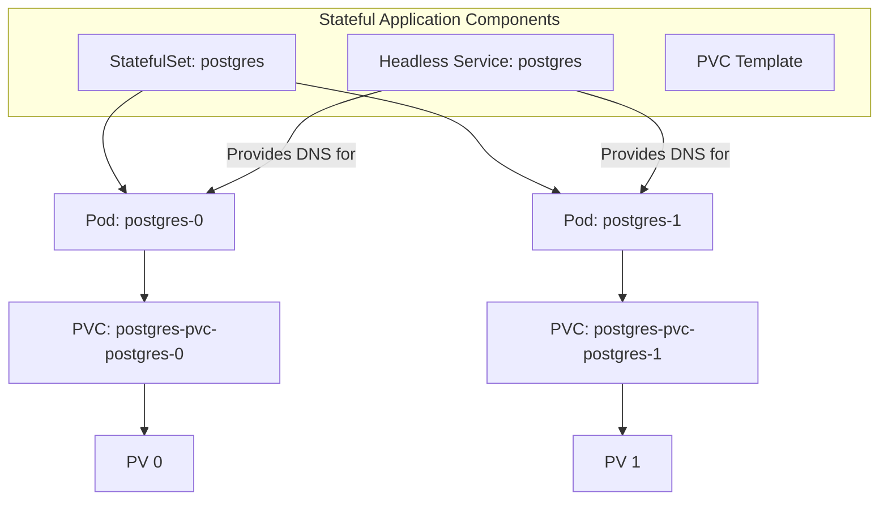

# Lesson 16: StatefulSets for PostgreSQL

## What We Learned
This lesson introduces the **StatefulSet**, a Kubernetes workload object used to manage stateful applications. We will create a StatefulSet to deploy our PostgreSQL database.

## Why Do We Need This?
Deployments are excellent for stateless applications, where any Pod can be replaced by any other Pod. The Pods are interchangeable. However, stateful applications like databases have different requirements:
-   **Stable, Unique Network Identifiers**: Each instance of the database needs a persistent, predictable hostname.
-   **Stable, Persistent Storage**: Each instance needs to be mapped to its own persistent storage volume.
-   **Ordered, Graceful Deployment and Scaling**: Database instances often need to be started, stopped, and scaled in a specific order.

A **StatefulSet** is designed to meet these needs. It provides strong guarantees about the ordering and uniqueness of its Pods.

**Key Features of a StatefulSet:**
-   **Stable, Unique Identifiers**: Pods created by a StatefulSet have a persistent identifier (e.g., `postgres-0`, `postgres-1`). The DNS name and hostname of the Pod are predictable.
-   **Stable, Persistent Storage**: Each Pod in a StatefulSet gets its own unique PersistentVolumeClaim, based on a template. If `postgres-0` is rescheduled, it will always be reattached to its original storage volume.
-   **Ordered Deployment and Scaling**: Pods are created one at a time, in order (`-0`, `-1`, `-2`). Scaling down happens in the reverse order.

## Architecture / Flow
A StatefulSet works in conjunction with a "headless" Service (a Service with `clusterIP: None`) to provide the stable network identities for its Pods.


- The StatefulSet creates Pods with ordinal indexes.
- Each Pod gets a corresponding PVC created from the `volumeClaimTemplates`.
- The Headless Service provides a DNS record for each Pod (e.g., `postgres-0.postgres.team-task-hub.svc.cluster.local`).

## Project Implementation
We need two things to deploy PostgreSQL: a StatefulSet and a Service to expose it.

**`k8s/postgres-statefulset.yaml`**
```yaml
apiVersion: apps/v1
kind: StatefulSet
metadata:
  name: postgres
  namespace: team-task-hub
spec:
  serviceName: "postgres" # Must match the headless service name
  replicas: 1
  selector:
    matchLabels:
      app: postgres
  template:
    metadata:
      labels:
        app: postgres
    spec:
      containers:
        - name: postgres
          image: postgres:13
          ports:
            - containerPort: 5432
          env:
            - name: POSTGRES_USER
              value: "user"
            - name: POSTGRES_PASSWORD
              value: "password"
            - name: POSTGRES_DB
              value: "user_db,task_db" # Simplified for this example
          volumeMounts:
            - name: postgres-storage
              mountPath: /var/lib/postgresql/data
  volumeClaimTemplates:
    - metadata:
        name: postgres-storage
      spec:
        accessModes: ["ReadWriteOnce"]
        resources:
          requests:
            storage: 1Gi
```

**`k8s/postgres-service.yaml`**
```yaml
apiVersion: v1
kind: Service
metadata:
  name: postgres
  namespace: team-task-hub
spec:
  ports:
    - port: 5432
  selector:
    app: postgres
  clusterIP: None # This makes it a headless service
```

**Key Fields in the StatefulSet:**
-   **`serviceName`**: Links the StatefulSet to its governing Headless Service.
-   **`volumeClaimTemplates`**: This is the magic part. It's a template for the PVCs. The StatefulSet will create one PVC for each Pod. The name of the PVC will be `[template-name]-[pod-name]` (e.g., `postgres-storage-postgres-0`).
-   **`volumeMounts`**: This mounts the PVC into the container's filesystem at the specified path.

## Commands
```bash
# Apply the service first
kubectl apply -f k8s/postgres-service.yaml

# Apply the statefulset
kubectl apply -f k8s/postgres-statefulset.yaml

# Check the resources
kubectl get statefulset postgres
kubectl get pods -l app=postgres
kubectl get pvc
```

## Important Takeaways
-   Use **StatefulSets** for stateful applications like databases.
-   StatefulSets provide stable hostnames and persistent storage for each Pod.
-   They work with a **Headless Service** for network identity.
-   The **`volumeClaimTemplates`** section is key for creating a unique PVC for each Pod replica.

## Navigation
| Previous Lesson | Main README | Next Lesson |
| :--- | :--- | :--- |
| [Lesson 15](../15-persistentvolume-and-persistentvolumeclaim/README.md) | [Main README](../../README.md) | [Lesson 17: Kubernetes Resource Requests & Limits](../17-kubernetes-resource-requests-and-limits/README.md) |
