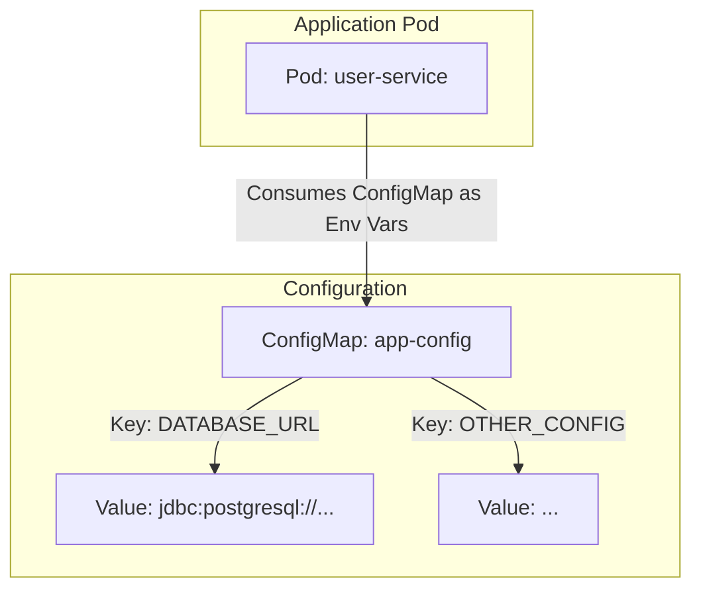

# Lesson 19: ConfigMaps

## What We Learned
This lesson introduces **ConfigMaps**, the standard Kubernetes way to manage configuration data for your applications. We'll learn how to externalize configuration from our container images and Deployment files.

## Why Do We Need This?
So far, we've been putting configuration, like database URLs, directly into our Deployment YAML as environment variables. This has several drawbacks:
-   **Mixing Config and Infrastructure**: The Deployment YAML defines *what* to run, not *how* it should be configured. Mixing these concerns makes the files harder to manage.
-   **Repetitive**: If multiple services need the same configuration value (e.g., a Kafka broker URL), you have to repeat it in every Deployment file.
-   **Difficult to Update**: To change a single configuration value, you have to edit and re-apply the entire Deployment YAML.
-   **Not Environment-Specific**: You might want to use different configurations for development, staging, and production. Hardcoding values makes this difficult.

**ConfigMaps** solve this by decoupling configuration from Pods. A ConfigMap is a Kubernetes object that stores configuration data as key-value pairs. You can then mount this data into your Pods as environment variables or as files.

## Architecture / Flow
The process is to create a ConfigMap and then reference it in the Pod specification.



## Project Implementation
We will create a ConfigMap to hold the configuration for our `user-service`.

**`k8s/user-service-configmap.yaml`**
```yaml
apiVersion: v1
kind: ConfigMap
metadata:
  name: user-service-config
  namespace: team-task-hub
data:
  # These are key-value pairs
  SPRING_DATASOURCE_URL: "jdbc:postgresql://postgres:5432/user_db"
  # Add other non-sensitive config here
```

Now, we can update our `user-service-deployment.yaml` to use this ConfigMap.

**`k8s/user-service-deployment.yaml` (updated `env` section)**
```yaml
# ... inside the containers spec ...
envFrom:
  - configMapRef:
      name: user-service-config
# We can still define other env vars if needed
env:
  - name: JWT_SECRET
    value: "your-super-secret-key-that-is-long-enough"
```

**Key Changes:**
-   We created a `ConfigMap` object with the desired key-value pairs in the `data` field.
-   In the Deployment, instead of listing each environment variable, we use `envFrom` and `configMapRef`. This tells Kubernetes to create an environment variable for each key in the `user-service-config` ConfigMap.

### Mounting ConfigMaps as Files
You can also mount a ConfigMap as a volume, where each key becomes a file in the specified directory. This is useful for applications that read configuration from files (e.g., `application.properties`).

```yaml
# In the Pod spec:
volumeMounts:
- name: config-volume
  mountPath: /etc/config
# ...
volumes:
- name: config-volume
  configMap:
    name: user-service-config
```
This would create a directory `/etc/config` in the container, with files named `SPRING_DATASOURCE_URL`, etc., containing the corresponding values.

## Commands
-   **Apply the ConfigMap:**
    ```bash
    kubectl apply -f k8s/user-service-configmap.yaml
    ```
-   **Apply the updated Deployment:**
    ```bash
    kubectl apply -f k8s/user-service-deployment.yaml
    ```
-   **Check the ConfigMap:**
    ```bash
    kubectl get configmap user-service-config -o yaml
    ```

## Important Takeaways
-   Use **ConfigMaps** to decouple configuration from your application code and Deployment manifests.
-   ConfigMaps can be consumed as **environment variables** or as **mounted files**.
-   This makes your application more portable and easier to manage across different environments.
-   **Important**: ConfigMaps are for non-sensitive data only. They are stored in plain text in the cluster. For secrets like passwords and API keys, we must use **Kubernetes Secrets**.

## Navigation
| Previous Lesson | Main README | Next Lesson |
| :--- | :--- | :--- |
| [Lesson 18](../18-kubernetes-troubleshooting/README.md) | [Main README](../../README.md) | [Lesson 20: Kubernetes Secrets](../20-kubernetes-secrets/README.md) |
