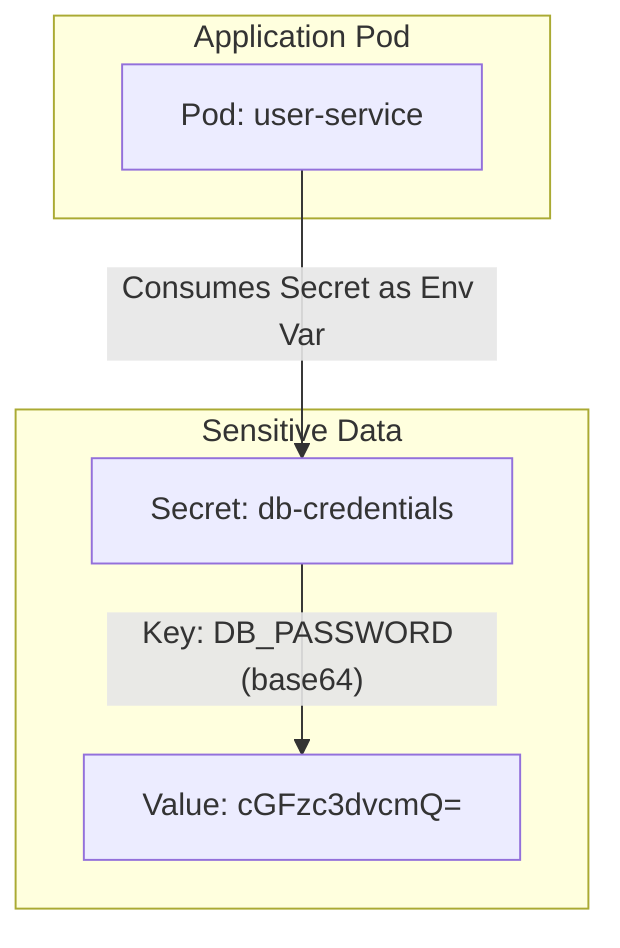

# Lesson 20: Kubernetes Secrets

## What We Learned
This lesson introduces **Kubernetes Secrets**, the proper way to manage sensitive information like passwords, API keys, and JWT secrets. We'll learn how to create Secrets and use them in our Pods.

## Why Do We Need This?
We've seen that ConfigMaps are great for general configuration, but they are **not encrypted**. Anyone with access to the Kubernetes API can read the data in a ConfigMap. Storing database passwords or other sensitive data in a ConfigMap or directly in a Deployment YAML is a major security risk.

**Kubernetes Secrets** are designed specifically for sensitive data. They are similar to ConfigMaps but have key differences:
-   **Storage**: By default, Secrets are stored in `etcd` (the Kubernetes data store) as base64-encoded strings. While base64 is not encryption, it prevents accidental exposure. More importantly, Kubernetes can be configured to encrypt secret data at rest.
-   **Usage**: Kubernetes handles Secrets with more care. For example, it avoids writing secret values to logs.
-   **Access Control**: You can use RBAC (Role-Based Access Control) to restrict who can read or modify Secrets.

**Rule of thumb: If the data is sensitive, use a Secret. If it's not, use a ConfigMap.**

## Architecture / Flow
The workflow is almost identical to using a ConfigMap. You create a Secret object and then reference it from your Pod to expose the data as environment variables or mounted files.



## Project Implementation
First, we need to create the secret data. The values must be base64 encoded.

```bash
# Encode the database password
echo -n 'password' | base64
# Output: cGFzc3dvcmQ=

# Encode the JWT secret
echo -n 'your-super-secret-key-that-is-long-enough' | base64
# Output: eW91ci1zdXBlci1zZWNyZXQta2V5LXRoYXQtaXMtbG9uZy1lbm91Z2g=
```

Now, we create the Secret YAML file.

**`k8s/secrets.yaml`**
```yaml
apiVersion: v1
kind: Secret
metadata:
  name: app-secrets
  namespace: team-task-hub
type: Opaque # The default type, for arbitrary key-value pairs
data:
  # The keys are plain text, but the values are base64 encoded
  POSTGRES_PASSWORD: cGFzc3dvcmQ=
  JWT_SECRET: eW91ci1zdXBlci1zZWNyZXQta2V5LXRoYXQtaXMtbG9uZy1lbm91Z2g=
```

Finally, we update our Deployment to use the Secret. We'll do this for both the `user-service` and the `postgres` StatefulSet.

**`k8s/user-service-deployment.yaml` (updated `env` section)**
```yaml
# ... inside the containers spec ...
envFrom:
  - configMapRef:
      name: user-service-config
env:
  - name: POSTGRES_USER
    value: "user" # This is not sensitive, can be in a ConfigMap too
  - name: POSTGRES_PASSWORD
    valueFrom:
      secretKeyRef:
        name: app-secrets
        key: POSTGRES_PASSWORD
  - name: JWT_SECRET
    valueFrom:
      secretKeyRef:
        name: app-secrets
        key: JWT_SECRET
```

**Key Changes:**
-   We created a `Secret` object with base64-encoded values.
-   In the Deployment, we use `valueFrom` and `secretKeyRef` to pull a specific key from our `app-secrets` Secret and expose it as an environment variable.

## Commands
-   **Apply the Secret:**
    ```bash
    kubectl apply -f k8s/secrets.yaml
    ```
-   **Apply the updated Deployment:**
    ```bash
    kubectl apply -f k8s/user-service-deployment.yaml
    ```
-   **Inspect the Secret:**
    ```bash
    # This will show you the base64 encoded values
    kubectl get secret app-secrets -o yaml

    # To decode a value from the cluster
    kubectl get secret app-secrets -o jsonpath='{.data.POSTGRES_PASSWORD}' | base64 --decode
    ```

## Important Takeaways
-   **Never store sensitive data in ConfigMaps or plain text YAML.**
-   Use **Secrets** for passwords, API keys, and other confidential information.
-   Secret values must be **base64 encoded** in the YAML file.
-   Use `secretKeyRef` in your Pod spec to consume secrets as environment variables.

## Navigation
| Previous Lesson | Main README | Next Lesson |
| :--- | :--- | :--- |
| [Lesson 19](../19-configmaps/README.md) | [Main README](../../README.md) | [Lesson 21: Kubernetes Service-to-Service Communication](../21-kubernetes-service-to-service-communication/README.md) |
