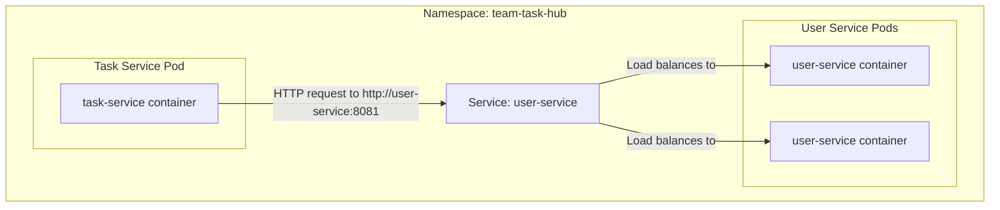

# Lesson 21: Kubernetes Service-to-Service Communication

## What We Learned
This lesson revisits how our microservices communicate, but now in the context of a Kubernetes cluster. We'll confirm how Kubernetes DNS and Services enable seamless communication between our `task-service` and `user-service`.

## Why Do We Need This?
In a local or Docker Compose environment, we might rely on `localhost` or container names for communication. In Kubernetes, Pods are ephemeral and their IPs change. As we learned in Lesson 14, **Kubernetes Services** provide the stable endpoint we need.

The key to this is **Kubernetes DNS**. The cluster has an internal DNS service that automatically creates DNS records for each Kubernetes Service. This allows Pods to discover and communicate with each other using predictable DNS names instead of volatile IP addresses.

## Architecture / Flow
When the `task-service` needs to call the `user-service`, it simply makes a request to the hostname `user-service`.



**How it works:**
1.  The `task-service` application (using Feign client) is configured to talk to `http://user-service:8081`.
2.  When the container makes a DNS query for `user-service`, the Kubernetes DNS service resolves this name to the stable ClusterIP of the `user-service` Service.
3.  The request is sent to the Service's ClusterIP.
4.  The Service then selects one of the healthy `user-service` Pods and forwards the request to it.

This all happens automatically. We don't need to configure any IP addresses.

## Project Implementation
The implementation relies on two things we've already configured:

1.  **The `user-service` Service:**
    We created a `ClusterIP` service for the `user-service` and named it `user-service`. This gives us the `http://user-service` DNS name.

    **`k8s/user-service-service.yaml`**
    ```yaml
    apiVersion: v1
    kind: Service
    metadata:
      name: user-service # This name becomes the DNS name
      namespace: team-task-hub
    spec:
      # ...
    ```

2.  **The `task-service` Configuration:**
    The `task-service` needs to know the address of the `user-service`. We can provide this via a ConfigMap.

    **`k8s/task-service-configmap.yaml`**
    ```yaml
    apiVersion: v1
    kind: ConfigMap
    metadata:
      name: task-service-config
      namespace: team-task-hub
    data:
      USER_SERVICE_URL: "http://user-service:8081"
      # ... other config
    ```
    Our Spring Boot application would then use this `USER_SERVICE_URL` environment variable to configure its Feign client.

## Testing from within the Cluster
You can verify this DNS resolution using `kubectl exec`.
```bash
# First, deploy the task-service (assuming you have a deployment yaml for it)
kubectl apply -f k8s/task-service-deployment.yaml

# Get the name of a running task-service pod
kubectl get pods -l app=task-service

# Exec into the pod
kubectl exec -it <task-service-pod-name> -- /bin/sh

# Inside the pod, use tools like nslookup, ping, or curl
# nslookup user-service
# Server:    10.96.0.10 (kube-dns)
# Address:   10.96.0.10#53
#
# Name:  user-service.team-task-hub.svc.cluster.local
# Address: 10.108.144.22  <-- This is the ClusterIP of the user-service

# curl http://user-service:8081/some-endpoint
```

## Important Takeaways
-   **Kubernetes DNS** is the backbone of service discovery.
-   Services are automatically assigned a DNS name equal to their `metadata.name`.
-   From within the same namespace, you can reach a service simply by its name.
-   Configure your applications to use these service DNS names for all inter-service communication.

## Navigation
| Previous Lesson | Main README | Next Lesson |
| :--- | :--- | :--- |
| [Lesson 20](../20-kubernetes-secrets/README.md) | [Main README](../../README.md) | [Lesson 22: Rolling Updates](../22-rolling-updates/README.md) |
