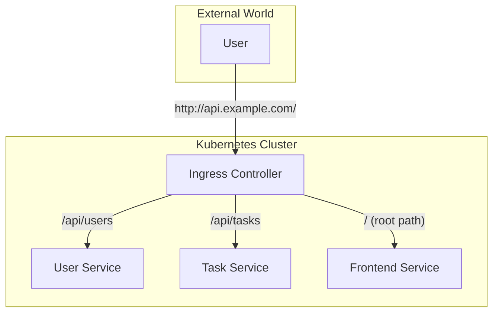

# Lesson 26: Frontend Deployment

## What We Learned
This lesson briefly covers the considerations for deploying a frontend application (e.g., React, Angular, Vue) in Kubernetes and routing traffic to it using our Ingress.

## Why Do We Need This?
Our backend microservices are now running, but a complete application needs a user interface. Deploying a frontend application in Kubernetes is slightly different from deploying a backend service.

Frontend applications are typically a collection of static files (HTML, CSS, JavaScript). They don't run as a typical server process like a Spring Boot application. To serve these files, we need a simple, lightweight web server like **NGINX**.

The process is:
1.  Build the frontend application to produce the static files.
2.  Create a Docker image containing these static files and an NGINX server to serve them.
3.  Create a Kubernetes Deployment to run the NGINX container.
4.  Create a Service to expose the frontend Pods.
5.  Update the Ingress to route traffic to the frontend service.

## Architecture / Flow
The Ingress Controller will now route traffic to three services: `user-service`, `task-service`, and our new `frontend-service`.



## Project Implementation

### 1. Frontend Dockerfile
Assuming you have a `build` or `dist` directory with your static frontend files, the `Dockerfile` would be very simple.

**`frontend/Dockerfile`**
```dockerfile
# Stage 1: Use a standard NGINX image
FROM nginx:alpine

# Stage 2: Copy the static files from your build output
COPY build/ /usr/share/nginx/html

# NGINX will automatically serve the index.html from this directory
EXPOSE 80
```

### 2. Frontend Deployment and Service
The Kubernetes manifests are standard.

**`k8s/frontend-deployment.yaml`**
```yaml
apiVersion: apps/v1
kind: Deployment
metadata:
  name: frontend-deployment
  namespace: team-task-hub
spec:
  replicas: 2
  selector:
    matchLabels:
      app: frontend
  template:
    metadata:
      labels:
        app: frontend
    spec:
      containers:
        - name: frontend
          image: your-frontend-image:latest
          ports:
            - containerPort: 80
```

**`k8s/frontend-service.yaml`**
```yaml
apiVersion: v1
kind: Service
metadata:
  name: frontend-service
  namespace: team-task-hub
spec:
  selector:
    app: frontend
  ports:
    - protocol: TCP
      port: 80
      targetPort: 80
```

### 3. Updated Ingress
We add a new rule to our Ingress to handle the root path (`/`).

**`k8s/ingress.yaml` (updated)**
```yaml
apiVersion: networking.k8s.io/v1
kind: Ingress
metadata:
  name: app-ingress
  # ...
spec:
  rules:
    - http:
        paths:
          - path: / # Root path for the frontend
            pathType: Prefix
            backend:
              service:
                name: frontend-service
                port:
                  number: 80
          - path: /api/users
            # ... user-service backend
          - path: /api/tasks
            # ... task-service backend
```
This configuration sends all traffic for the root of the site to the frontend, while API calls are correctly routed to their respective backend services.

## Important Takeaways
-   Frontend applications are typically deployed as **static files served by a web server like NGINX**.
-   The deployment process involves creating a simple Docker image with the static files and an NGINX server.
-   The **Ingress** is updated to route traffic to the frontend service, typically for the root path (`/`).

## Navigation
| Previous Lesson | Main README | Next Lesson |
| :--- | :--- | :--- |
| [Lesson 25](../25-ingress-external-access/README.md) | [Main README](../../README.md) | [Lesson 27: Complete Deployment Architecture](../27-complete-deployment-architecture/README.md) |
