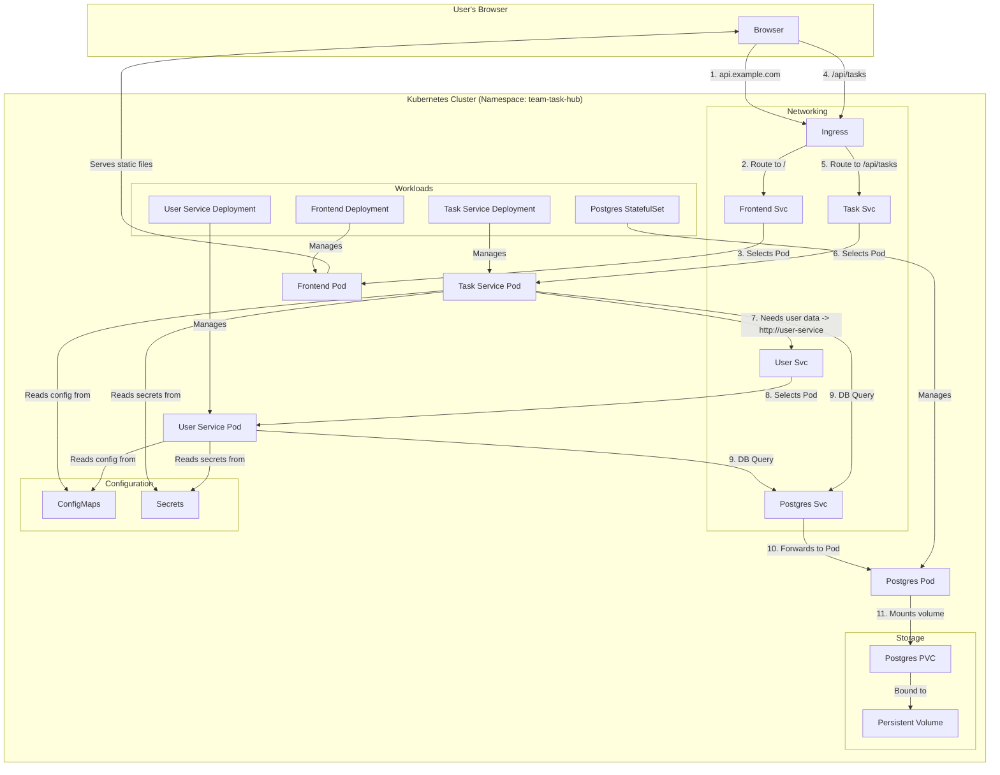

# Lesson 27: Complete Deployment Architecture

## What We Learned
This lesson provides a holistic view of our entire application deployed on Kubernetes. We'll visualize how all the different components we've built—Deployments, StatefulSets, Services, ConfigMaps, Secrets, and Ingress—work together to form a complete, robust system.

## The Big Picture
Let's review the journey of a request from the user's browser to the database and back.

## The Flow Explained
1.  **Initial Request**: A user navigates to our application's URL. The request hits the **Ingress Controller**.
2.  **Frontend Routing**: The Ingress sees that the path is `/` (root) and, based on its rules, routes the request to the `frontend-service`.
3.  **Serving the UI**: The `frontend-service` load balances the request to a healthy `frontend` Pod, which serves the static HTML, CSS, and JavaScript back to the browser.
4.  **API Call**: The user performs an action in the UI (e.g., creating a task), which triggers an API call to `/api/tasks`. This request goes back to the **Ingress Controller**.
5.  **Backend Routing**: The Ingress sees the path `/api/tasks` and routes the request to the `task-service`.
6.  **Task Service Logic**: The `task-service` receives the request. It reads its configuration (like database URLs) from a **ConfigMap** and its secrets (like the database password) from a **Secret**.
7.  **Service-to-Service Call**: The `task-service` needs to validate the user, so it makes an internal HTTP call to `http://user-service`. Kubernetes DNS resolves this name to the `user-service`'s ClusterIP.
8.  **User Service Logic**: The `user-service` receives the request, performs its logic, and perhaps reads its own ConfigMaps and Secrets.
9.  **Database Communication**: Both the `user-service` and `task-service` need to talk to the database. They make requests to the `postgres` Service.
10. **StatefulSet Routing**: The `postgres` Service forwards the request to the running `postgres` Pod (e.g., `postgres-0`).
11. **Persistent Storage**: The `postgres` Pod writes its data to its mounted volume, which is a **PersistentVolumeClaim (PVC)**. This PVC is bound to a **PersistentVolume (PV)**, ensuring the data is safe even if the Pod is restarted.

## Key Takeaways
-   **Ingress** acts as the front door to the cluster.
-   **Services** provide the internal networking and DNS-based discovery.
-   **Deployments** manage our stateless frontend and backend applications.
-   **StatefulSets** manage our stateful database.
-   **ConfigMaps and Secrets** decouple configuration and sensitive data from our application images.
-   **PersistentVolumes and PersistentVolumeClaims** provide durable storage for our database.

This entire architecture, defined in a set of YAML files, gives us a scalable, resilient, and maintainable system.

## Navigation
| Previous Lesson | Main README | Next Lesson |
| :--- | :--- | :--- |
| [Lesson 26](../26-frontend-deployment/README.md) | [Main README](../../README.md) | [Lesson 28: Final Revision & Interview Notes](../28-final-revision-and-interview-notes/README.md) |
